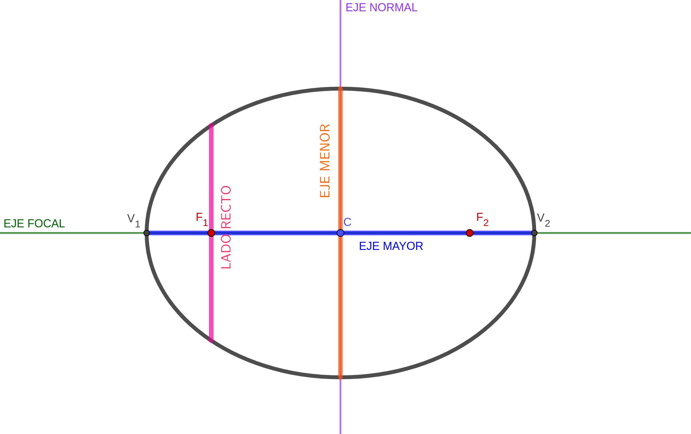
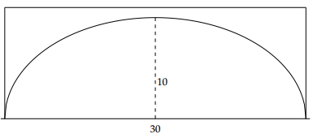

```{r xaringan-themer, include=FALSE, warning=FALSE}
library(xaringanthemer)
style_mono_accent(
  base_color = "#003a6c",
  background_color = "#ffffff",
  header_background_color = "#ffffff",
  header_h1_font_size = "2.5em",
  header_h2_font_size = "2em",
  header_h3_font_size = "1.5em",
  header_color = "#ffffff"
)
```

```{r setup, include=FALSE}
options(htmltools.dir.version = FALSE)
```


class: left, bottom
background-image: url(Logo_ufro_azul.png)
background-position: 94% 10%
background-size: 20%


# **`r rmarkdown::metadata$title`**
----
## **`r rmarkdown::metadata$subtitle`**
### **`r rmarkdown::metadata$author`**
### **`r rmarkdown::metadata$date`**

---

class: inverse, center, middle

# Capítulo 3. Secciones Cónicas

---
class: left, upper, inverse_header_color
background-image: url(fondo.png)
background-position: 45% 3.5%
background-size: 100%


## Secciones Cónicas

--

Las secciones cónicas son los lugares geométricos descritos por las ecuaciones con dos incógnitas de la forma

$$Ax^2+Cy^2+Dx+Ey+F=0$$
--
Visualmente, estos lugares geométricos se pueden extraer seccionando un cono como muestra la figura
--
<center>

</center>

---

class: left, upper, inverse_header_color
background-image: url(fondo.png)
background-position: 45% 3.5%
background-size: 100%

## Parábola
--

<hr/>
**Definición:** La parábola es el lugar geométrico de todos los puntos cuya distancia a un punto fijo $F$, llamado **foco**, es igual a la distancia a una recta $L$, llamada **directriz**.
<hr/>
--

Veamos la aplicación de Geogebra de [Irina Boyadzhiev](https://www.geogebra.org/m/nDUUv3Zg)

--

<iframe src="https://www.geogebra.org/classic/yzrhxuhh?embed" width="700" height="400" allowfullscreen style="border: 1px solid #e4e4e4;border-radius: 4px;" frameborder="0"></iframe>

---

class: left, upper, inverse_header_color
background-image: url(fondo.png)
background-position: 45% 3.5%
background-size: 100%

## Elementos de la Parábola

--

- **Eje de simetría.** Es la recta perpendicular a la directriz y que pasa por el foco.

--

- **Vértice.** Es el punto medio entre el foco y la directriz.

--

- **Cuerda.** Es el segmento que une dos puntos cualesquiera de la parábola.

--

- **Cuerda Focal.** Cualquier cuerda que pasa por el foco. 
--

- **Lado Recto.** Es la cuerda focal perpendicular al eje de simetría. 
--
<br/>

<center>

</center>

---

class: left, upper, inverse_header_color
background-image: url(fondo.png)
background-position: 45% 3.5%
background-size: 100%

class: left, upper, inverse_header_color
background-image: url(fondo.png)
background-position: 45% 3.5%
background-size: 100%

## Ecuaciones de la Parábola

--

<hr/>
**Teorema.** 

- La ecuación de la parábola con vértice $V(h,k)$ y eje de simetría paralelo al eje $X$ es

$$(y-k)^2 = 4p(x-h)$$ donde $|p|$ es la longitud del segmento que forma el foco con el vértice. Además si $p<0$ la parábola se abre hacia la izquierda y si $p<0$ la parábola se abre hacia la derecha.

--

- La ecuación de la parábola con vértice $V(h,k)$ y eje de simetría paralelo al eje $Y$ es

$$(x-h)^2 = 4p(y-k)$$ donde $|p|$ es la longitud del segmento que forma el foco con el vértice. Además si $p<0$ la parábola se abre hacia abajo y si $p<0$ la parábola se abre hacia arriba.

<hr/>

---
class: inverse

### Introducción a la Elipse

--

<br/>

<center>
<iframe width="560" height="315" src="https://www.youtube.com/embed/DNo-0By5384?start=66" title="YouTube video player" frameborder="0" allow="accelerometer; autoplay; clipboard-write; encrypted-media; gyroscope; picture-in-picture" allowfullscreen></iframe>
<center/>
---

class: left, upper, inverse_header_color
background-image: url(fondo.png)
background-position: 45% 3.5%
background-size: 100%

## ELIPSE

--

<hr/>
**Definición:** La elipse es el lugar geométrico de todos los puntos que se mueven en un plano de tal manera que **la suma de las distancias a dos puntos fijos de ese plano, llamados focos, es siempre igual a una constante**. La constante es mayor que la distancia entre los dos puntos.
<hr/>

--

Veamos la aplicación de Geogebra de [Namirah Fatmanissa y Tim Brzezinski](https://www.geogebra.org/m/ufcghzvn)

--

<iframe src="https://www.geogebra.org/classic/g5heeuwm?embed" width="700" height="600" allowfullscreen style="border: 1px solid #e4e4e4;border-radius: 4px;" frameborder="0"></iframe>

---


class: left, upper, inverse_header_color
background-image: url(fondo.png)
background-position: 45% 3.5%
background-size: 100%

## Elementos de la elipse

<br/>

--

- **Eje Focal.** Es la recta que pasa por ambos focos.

--

- **Vértices.** Son los puntos donde se intersectan el eje focal con la elipse.

--

- **Eje Mayor.** Es el segmento que une los vértices.

--

- **Centro.** Es el punto medio entre ambos focos. 

--

- **Eje Normal.** Es la recta que pasa por el centro y es perpendicular al eje focal. 

--

- **Eje Menor.** Es el segmento que forman los puntos de intersección entre la elipse y el eje normal

--

- **Lado Recto.** Es la cuerda focal que pasa por el foco y es perpendicular al eje focal.

---

class: left, upper, inverse_header_color
background-image: url(fondo.png)
background-position: 45% 3.5%
background-size: 100%

## Elementos de la elipse

<br/>

<center>

</center>

---


class: inverse, center, middle

# Encontremos la ecuación de la elipse 👀

---

class: left, upper, inverse_header_color
background-image: url(fondo.png)
background-position: 45% 3.5%
background-size: 100%

### Ecuaciones de la Elipse con centro en el origen

<br/>
<br/>

--

<hr/>

- Si el eje focal es paralelo al eje $X$, la ecuación de la elipse con focos $F_1(-c,0)$ y $F_2(c,0)$ y centro en el origen es

$$\dfrac{x^2}{a^2}+\dfrac{y^2}{b^2} = 1$$

<hr/>

--

- Si el eje focal es paralelo al eje $Y$, la ecuación de la elipse con focos $F_1(0,-c)$ y $F_2(0,c)$ y centro en el origen es

$$\dfrac{x^2}{b^2}+\dfrac{y^2}{a^2} = 1$$
<hr/>

---

class: left, upper, inverse_header_color
background-image: url(fondo.png)
background-position: 45% 3.5%
background-size: 100%

### Observaciones

<br/>

<br/>


- En ambas ecuaciones se tiene que $b^2 = a^2-c^2$ y que $2a$ es el **eje mayor**. 

--

- De las ecuaciones se obtiene que el **lado recto** es $\dfrac{2b^2}{a}$.

--

<hr/>

- **Excentricidad.** Es el parámetro que determina el grado de desviación de la elipse con respecto a la circunferencia y se calcula como

$$e = \dfrac{c}{a} = \dfrac{\sqrt{a^2-b^2}}{a}$$

<hr/>

--

<center>
<em> Si $e$ se acerca a cero, la elipse se parecerá a una circunferencia. 🧐<em/>
<center/>
---
class: left, upper, inverse_header_color
background-image: url(fondo.png)
background-position: 45% 3.5%
background-size: 100%

## Visualización de la excentricidad

Desliza uno de los focos hacia el centro y luego hacia uno de los véritces. Observa la relación entre la forma y la excentricidad.

<iframe src="https://www.geogebra.org/classic/gj8bn8mr?embed" width="800" height="600" allowfullscreen style="border: 1px solid #e4e4e4;border-radius: 4px;" frameborder="0"></iframe>


---

class: left, upper, inverse_header_color
background-image: url(fondo.png)
background-position: 45% 3.5%
background-size: 100%

## Ecuaciones Canónicas de la Elipse

--

<hr/>
**Teorema.** 

- La ecuación de la elipse con centro $V(h,k)$ y eje de focal paralelo al eje $X$ es

$$\dfrac{(x-h)^2}{a^2}+\dfrac{(y-k)^2}{b^2} = 1$$

--

- La ecuación de la elipse con vértice $V(h,k)$ y eje focal paralelo al eje $Y$ es

$$\dfrac{(x-h)^2}{b^2}+\dfrac{(y-k)^2}{a^2} = 1$$ 

<hr/>

--

Las observaciones de la diapositiva anterior son las mismas para estas ecuaciones, es decir

--

- $a^2 = c^2+b^2$, donde $a$ es el *semieje mayor*.
- $e = \dfrac{c}{a}$.
- El lado recto mide $\dfrac{2b^2}{a}$.

---

class: left, upper, inverse_header_color
background-image: url(fondo.png)
background-position: 45% 3.5%
background-size: 100%

## Ejercicios


**1.** Encontrar la ecuación de la elipse cons vértices en $(1, 4)$ y $(9,4)$ y su semieje menor es 2.

--

**2.** Encontrar la ecuación de la elipse que tiene un foco en $F(1, −3)$ y $C(1, −1)$, y cuya excentricidad es igual a $\dfrac{1}{2}$.

--

**3.** El centro de una elipse es el punto $(2, −4)$ y un vértice es $(−2, −4)$. Si el lado recto se halla sobre la recta $x = −1$, hallar la ecuación de esta elipse.

--

**4.** Encontrar el lugar geométrico de los puntos cuya distancia al origen es $\dfrac{1}{2}$ de su distancia a la recta $L_1 : x + 3 = 0.$

---

class: left, upper, inverse_header_color
background-image: url(fondo.png)
background-position: 45% 3.5%
background-size: 100%

## Ejercicios


**5.** El arco de un puente sobre un río es semielíptico, con eje mayor
horizontal. El ancho del río es de 30 mts, la parte más alta del arco del puente mide 10 mts, como muestra la figura. Encuentre la altura del del arco del puente a los 6 mts de los pilares.


<center>

</center>


