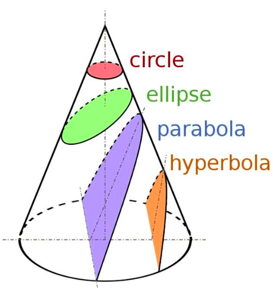

```{r xaringan-themer, include=FALSE, warning=FALSE}
library(xaringanthemer)
style_mono_accent(
  base_color = "#003a6c",
  background_color = "#ffffff",
  header_background_color = "#ffffff",
  header_h1_font_size = "2.5em",
  header_h2_font_size = "2em",
  header_h3_font_size = "1.5em",
  header_color = "#ffffff"
)
```

```{r setup, include=FALSE}
options(htmltools.dir.version = FALSE)
```


class: left, bottom
background-image: url(Logo_ufro_azul.png)
background-position: 94% 10%
background-size: 20%


# **`r rmarkdown::metadata$title`**
----
## **`r rmarkdown::metadata$subtitle`**
### **`r rmarkdown::metadata$author`**
### **`r rmarkdown::metadata$date`**

---

class: inverse, center, middle

# Capítulo 3. Secciones Cónicas

---
class: left, upper, inverse_header_color
background-image: url(fondo.png)
background-position: 45% 3.5%
background-size: 100%

## Recuerdo
--

En la **unidad 1** determinamos ecuaciones con dos variables para describir una recta y una esfera. 

--

- **Ecuación General de la Recta:** $Dx+Ey+F= 0$

--

<center><iframe src="https://www.geogebra.org/classic/ubqnw424?embed" width="700" height="400" allowfullscreen style="border: 1px solid #e4e4e4;border-radius: 4px;" frameborder="0"></iframe></iframe><center>


---
class: left, upper, inverse_header_color
background-image: url(fondo.png)
background-position: 45% 3.5%
background-size: 100%

## Recuerdo

--

- **Ecuación General de la Circunferencia** $Ax^2+Cy^2+Dx+Ey+F=0$

--

<iframe src="https://www.geogebra.org/classic/ggaqpx4b?embed" width="800" height="400" allowfullscreen style="border: 1px solid #e4e4e4;border-radius: 4px;" frameborder="0"></iframe>


---

class: left, upper, inverse_header_color
background-image: url(fondo.png)
background-position: 45% 3.5%
background-size: 100%

## Secciones Cónicas

--

Las secciones cónicas son los lugares geométricos descritos por las ecuaciones con dos incógnitas de la forma

$$Ax^2+Cy^2+Dx+Ey+F=0$$
--
Visualmente, estos lugares geométricos se pueden extraer seccionando un cono como muestra la figura
--
<center>

</center>

---

class: left, upper, inverse_header_color
background-image: url(fondo.png)
background-position: 45% 3.5%
background-size: 100%

## Traslación de Ejes

--

Antes de estudiar cada sección del cono, necesitamos entender el traslado de ejes coordenados.
--

Esto nos permitirá trabajar con la ecuación general del lugar geométrico en cuestión. 

--

<hr/>
**Teorema.** *Si trasladamos los ejes coordenados a un nuevo origen, digamos $O'(h, k)$, y si las coordenadas de cualquier punto $P$ antes y después de la traslación son $(x, y)$ y $(x', y'′)$ respectivamente, las
ecuaciones de traslación del sistema primitivo al nuevo sistema de coordenadas son,*

$$x = x' + h \,\, \wedge \,\, y = y' + k$$
<hr/>

--

**Demostración.** Ver Apuntes y Geogebra.

[Geogebra aquí](https://www.geogebra.org/classic/sbxprexa)👈🏼

---

class: left, upper, inverse_header_color
background-image: url(fondo.png)
background-position: 45% 3.5%
background-size: 100%

## Parábola
--

<hr/>
**Definición:** La parábola es el lugar geométrico de todos los puntos cuya distancia a un punto fijo $F$, llamado **foco**, es igual a la distancia a una recta $L$, llamada **directriz**.
<hr/>
--

Veamos la aplicación de Geogebra de [Irina Boyadzhiev](https://www.geogebra.org/m/nDUUv3Zg)

--

<iframe src="https://www.geogebra.org/classic/yzrhxuhh?embed" width="700" height="400" allowfullscreen style="border: 1px solid #e4e4e4;border-radius: 4px;" frameborder="0"></iframe>

---

class: left, upper, inverse_header_color
background-image: url(fondo.png)
background-position: 45% 3.5%
background-size: 100%

## Elementos de la Parábola

--

- **Eje de simetría.** Es la recta perpendicular a la directriz y que pasa por el foco.

--

- **Vértice.** Es el punto medio entre el foco y la directriz.

--

- **Cuerda.** Es el segmento que une dos puntos cualesquiera de la parábola.

--

- **Cuerda Focal.** Cualquier cuerda que pasa por el foco. 
--

- **Lado Recto.** Es la cuerda focal perpendicular al eje de simetría. 
--
<br/>

<center>

</center>

---

class: inverse, center, middle

# Encontremos la ecuación de la parábola 👀

---

class: left, upper, inverse_header_color
background-image: url(fondo.png)
background-position: 45% 3.5%
background-size: 100%

### Ecuaciones de la Parábola con vértice en el origen
--
<br/>
<br/>

<hr/>

- Si el eje de simetría es paralelo al eje $X$, la ecuación de la parábola con vértice $(0,0)$ y foco $(p,0)$ con $p>0$ es

$$y^2 = 4px$$

--

Si el foco es $(-p,0)$ entonces la ecuación es $y^2=-4px$.

<hr/>


--
- Si el eje de simetría es paralelo al eje $Y$, la ecuación de la parábola con vértice $(0,0)$ y foco $(0,p)$ con $p>0$ es

$$x^2 = 4py$$
Si el foco es $(0,-p)$ entonces la ecuación es $x^2=-4py$

<hr/>

---

class: left, upper, inverse_header_color
background-image: url(fondo.png)
background-position: 45% 3.5%
background-size: 100%

## Ecuaciones de la Parábola

--

<hr/>
**Teorema.** 

- La ecuación de la parábola con vértice $V(h,k)$ y eje de simetría paralelo al eje $X$ es

$$(y-k)^2 = 4p(x-h)$$ donde $|p|$ es la longitud del segmento que forma el foco con el vértice. Además si $p<0$ la parábola se abre hacia la izquierda y si $p<0$ la parábola se abre hacia la derecha.

--

- La ecuación de la parábola con vértice $V(h,k)$ y eje de simetría paralelo al eje $Y$ es

$$(x-h)^2 = 4p(y-k)$$ donde $|p|$ es la longitud del segmento que forma el foco con el vértice. Además si $p<0$ la parábola se abre hacia abajo y si $p<0$ la parábola se abre hacia arriba.

<hr/>

--

**Demostración.** Ver apuntes
---

class: left, upper, inverse_header_color
background-image: url(fondo.png)
background-position: 45% 3.5%
background-size: 100%

## Ejercicios


**1.** Encontrar la ecuación de la parábola cuyo vértice está en $(5, −2)$ y su foco en $(5, −4)$.

--

**2.** Consideremos la siguiente curva: $9x^2 + 24x + 72y − 20 = 0$ determinemos las coordenadas del vértice y del foco, las ecuaciones de la directriz y del eje focal, y la longitud del lado recto.

--

**3.** Encontrar la ecuación de la parábola cuyo foco tiene coordenadas $F(5, −4)$ y tiene por directriz la recta $x = 1$.

--

**4.** El agua que fluye de un grifo horizontal que está a 20 mts del suelo describe una curva parabólica con vértice en el grifo. Si a 16 mts del suelo, el flujo del agua se ha alejado 8 mts de la recta vertical que pasa por el grifo, ¿A qué distancia de esta recta vertical tocará
el agua el suelo?

--

**5.** Hallar e identificar la ecuación del lugar geométrico de un punto que se mueve de tal manera que su distancia de la recta $L_1 : x + 3 = 0$ es siempre $2$ unidades mayor que su distancia del punto $P_1(1, 1)$.


